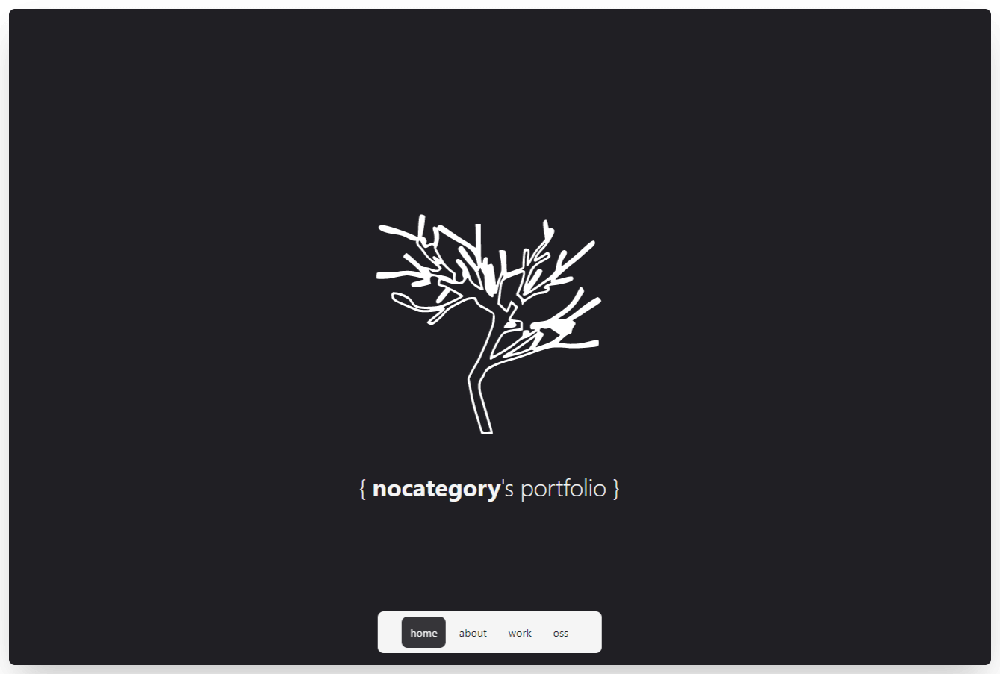

  
   
   
  This project is based on Netlify's next-on-netlify (https://github.com/netlify/next-on-netlify) and it is just... my portfolio! <strike>(as the repo name says duh)</strike>
     
  proudly hosted on netlify
     
  made with ❤️

